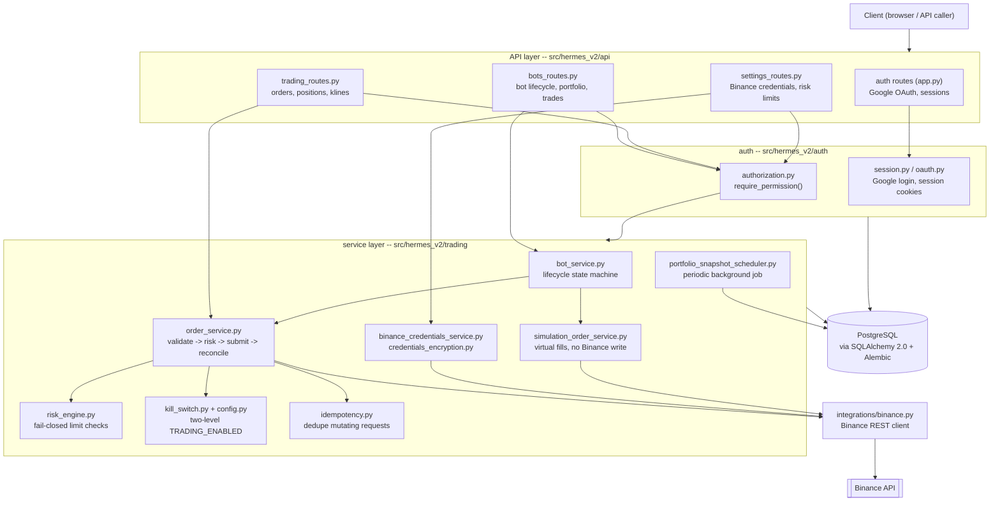

# Hermes v2

Hermes v2 is a modular backend platform for automating trading bots against
the Binance API. It's a personal engineering project, built and audited to
the standard of a real financial backend: multi-tenant, permissioned,
encrypted-at-rest, kill-switched, and idempotent by design.

**This README documents software engineering — architecture, reliability,
and security — not a trading strategy.** Hermes ships a working Binance
execution path with risk controls around it; it makes no claim about
profitability, and none should be inferred from its existence. See
[Simulation vs LIVE](#simulation-vs-live) for exactly what "working" means
and doesn't mean.

---

## Table of contents

- [What is Hermes?](#what-is-hermes)
- [Key capabilities](#key-capabilities)
- [Architecture](#architecture)
- [Security model](#security-model)
- [Simulation vs LIVE](#simulation-vs-live)
- [Quick start](#quick-start)
- [Project structure](#project-structure)
- [Testing](#testing)
- [Responsible use](#responsible-use)

---

## What is Hermes?

Hermes is a FastAPI/PostgreSQL backend that lets a user create **bots** —
independently configured, independently lifecycled trading agents, each
tied to one instrument (e.g. `BTCUSDT`) — and run them in one of two modes:

- **SIMULATION**: paper trading against a virtual, per-bot ledger, priced
  with real Binance market data but never touching a real balance.
- **LIVE**: real orders placed against the operator's own connected
  Binance account, through the exact same order-execution path (risk
  engine → idempotency → Binance client → reconciliation) that SIMULATION
  exercises with a fake fill instead.

Every user manages their own bots, their own encrypted Binance credentials,
and their own risk limits — the system is multi-tenant, not a single
operator's personal script. The engineering focus throughout has been:
*what happens when this fails, races, or gets called twice?* — not
*what's the best entry signal?*

## Key capabilities

Everything below exists in the codebase today and is exercised by the test
suite; nothing here is aspirational.

- **Bot lifecycle management** — create, pause, resume, stop, delete, each
  a guarded state transition (`src/hermes_v2/trading/bot_service.py`), not
  a free-form status field.
- **SIMULATION mode** — a virtual per-bot cash ledger, fills priced from
  real Binance market data, with realized P&L, exposure, return %, and
  max-drawdown tracking computed from actual fill history
  (`simulation_portfolio_service.py`, `portfolio_snapshot_service.py`).
- **LIVE mode** — real order placement through `OrderService`, reachable
  only by promoting an already-tested, already-paused SIMULATION bot
  (never selectable at creation) — see
  [Simulation vs LIVE](#simulation-vs-live).
- **Binance integration** (`integrations/binance.py`) — a small, deliberately
  minimal REST client: order placement, account/balance reads, market data,
  exchange info, with request timeouts and typed errors for auth failures
  vs. rate limits vs. generic failures. No wallet/withdrawal endpoint is
  implemented anywhere in the client, by design.
- **Multi-tenant, encrypted Binance credentials** — each user connects
  their own API key/secret; a key with withdrawal permission enabled is
  rejected outright before it's ever stored
  (`binance_credentials_service.py`).
- **Configurable, fail-closed risk engine** — per-user limits (max order
  size, max symbol/total exposure, max daily loss, max open positions,
  an allowed-symbol list); any limit left unset is treated as "reject on
  that dimension," never as "unlimited" (`risk_engine.py`).
- **Two-level trading kill switch** — a global `TRADING_ENABLED` env flag
  plus a per-user database switch, checked inside `OrderService` itself
  (not only at the route layer), so no code path can place a real order
  while either is off (`trading/config.py`, `trading/kill_switch.py`).
- **Idempotency keys** on every mutating endpoint — a duplicated or retried
  request replays the original stored result instead of acting twice
  (`trading/idempotency.py`).
- **RBAC** — 31 seeded permissions, enforced through a `require_permission`
  FastAPI dependency at 37 call sites across every mutating route
  (`auth/authorization.py`, `auth/seed.py`).
- **Rate limiting** — 15 dedicated sliding-window limiters, one per
  sensitive action (order placement, bot lifecycle actions, credential
  updates, auth), not one global limit (`trading/rate_limiting.py`,
  `auth/rate_limiting.py`).
- **Google OAuth authentication** — authorization-code flow with
  server-side token exchange, ID-token issuer/audience verification, an
  exact-match open-redirect allowlist, and hashed, constant-time-compared
  session tokens (`auth/oauth.py`, `auth/session.py`). No self-signup —
  users are provisioned by an operator.
- **Automated testing** — a real (not mocked) PostgreSQL integration test
  suite; see [Testing](#testing).
- **Docker + CI security scanning** — non-root container user, `bandit`
  (static analysis), `pip-audit` (dependency vulnerabilities), and Trivy
  (image/OS CVEs) all run in CI on every push; see
  [Security model](#security-model).

**Explicitly not implemented** (so this list stays honest): stop-loss,
trailing-stop, automatic dust conversion, a "sell everything" action, or
any Telegram/chat integration. None of these are referenced anywhere in
the trading code — if you're looking for them, they don't exist yet.

## Architecture



**API layer** (`src/hermes_v2/api/`) — four thin FastAPI routers. Each
route resolves the caller, checks one specific permission, delegates to a
service, and shapes the response. No business logic lives here.

**Service layer** (`src/hermes_v2/trading/`, `src/hermes_v2/auth/`) — where
every real decision is made: `BotService` owns the bot state machine,
`OrderService` owns the validate → risk-check → submit → reconcile
pipeline (used identically by manual orders and by a LIVE bot's
pause/resume), `RiskEngine` and the kill switch are consulted *inside*
`OrderService`, not only at the route layer, so nothing can bypass them by
calling a service directly.

**Binance integration** (`src/hermes_v2/integrations/binance.py`) — the
only module that talks to Binance. Deliberately minimal: no
wallet/withdrawal capability exists in the client at all.

**Persistence** (`src/hermes_v2/database/`, `alembic/`) — PostgreSQL via
SQLAlchemy 2.0, hand-written and reviewed Alembic migrations (not
autogenerated-and-forgotten), `Decimal` for every monetary/quantity column
(never `float`).

**Background processing** — one periodic job,
`PortfolioSnapshotScheduler`, runs on its own thread inside the same
process to record equity-curve snapshots; it runs regardless of
`TRADING_ENABLED` because it only reads, never places an order.

**Authentication/authorization** (`src/hermes_v2/auth/`) — Google OAuth
for identity, a first-party session cookie for subsequent requests, and a
seeded RBAC permission catalog enforced via a FastAPI dependency.

**Configuration & observability** — environment-variable configuration
read at the point of use (no config framework), structured logging on
every state transition and auth event, and a `/health` endpoint for
container orchestration.

Full design records (including rejected alternatives, not just the final
shape) live under [`docs/architecture/`](docs/architecture/).

## Security model

This is the part most worth reading closely if you're evaluating Hermes as
an engineering sample rather than a product.

- **`TRADING_ENABLED`** (env var, default `false`) — the platform-wide kill
  switch. Checked inside `OrderService` itself, so no route, no future
  internal caller, and no script run by hand can place or cancel a real
  order while it's off. Nothing in this codebase — not `docker compose
  up`, not a migration, not a deploy — ever sets it to `true`
  automatically. An operator flips it by hand, deliberately, on the host.
- **Per-user trading switch** — a second, per-user kill switch in the
  database, checked *after* the global one. Lets one user pause their own
  trading without affecting anyone else, but can never turn trading on if
  the global switch is off.
- **Encrypted Binance credentials at rest** — API keys/secrets are
  encrypted with `cryptography`'s `MultiFernet` (AES-128-CBC +
  HMAC-SHA256, authenticated encryption) before ever reaching the
  database; plaintext is never persisted. `MultiFernet` supports **key
  rotation** without downtime — a new key encrypts going forward while
  old keys still decrypt existing rows until they're re-encrypted.
- **Fail-closed risk engine** — per-user limits (order size, symbol/total
  exposure, daily loss, open positions, allowed symbols) that are *unset*
  are treated as "reject," never as "unlimited." There is no configuration
  state that silently means "no limit."
- **RBAC** — 31 seeded permissions, enforced through a FastAPI dependency
  at every mutating route; no endpoint trusts the frontend to have already
  decided whether an action is allowed.
- **Idempotency keys** on every mutating request — a network retry or a
  double-click replays the original result instead of submitting a second
  order.
- **CORS** — an exact-match origin allowlist, never combined with a
  wildcard, since credentialed (cookie-based) requests and `*` are
  mutually exclusive by design here.
- **Rate limiting** — 15 dedicated sliding-window limiters on sensitive
  actions (auth, credential changes, order placement, bot lifecycle),
  distinct from a single global limit.
- **Secret handling** — every credential (DB password, Google OAuth
  secret, Binance keys, encryption key) is read from the environment at
  the point of use, never hardcoded, never logged. `.env`/`.env.*` are
  gitignored with explicit exceptions only for the two checked-in
  `*.example` templates.
- **No secret has ever been committed** — verified against the repository's
  full Git history (every commit, every branch), not only the current
  working tree.
- **CI security scanning** — `bandit` (static analysis), `pip-audit`
  (dependency CVEs), and Trivy (container image/OS CVEs) run on every
  push; the Trivy job fails the build on a CRITICAL/HIGH finding.

None of this is a claim that Hermes is unconditionally "secure" — no
non-trivial system is. It's a description of the specific controls that
exist, so they can be verified by reading the code rather than taken on
faith. No vulnerabilities are known within the audited scope at the time
of writing. See [`SECURITY_AUDIT.md`](SECURITY_AUDIT.md) for the full
current-state audit (methodology, scope, and known limitations), and
[`SECURITY_AUDIT_PHASE_1.md`](SECURITY_AUDIT_PHASE_1.md) for the earlier,
pre-trading audit it supersedes.

## Simulation vs LIVE

**Cloning this repository and running `docker compose up` does not enable
real trading.** This isn't a single flag — it's layered:

1. `TRADING_ENABLED` defaults to `false` in code and in both
   `.env.example`/`.env.dev.example` templates. It's absent from every
   default configuration; an operator sets it explicitly, on their own
   host, after reading what it does.
2. `BINANCE_API_KEY`/`BINANCE_API_SECRET` are empty in every template.
   Even with `TRADING_ENABLED=true`, there's no credential to sign an
   order with.
3. A bot is created in **SIMULATION** and cannot be created as LIVE — that
   option doesn't exist on bot creation.
4. Promoting a bot to LIVE is a separate, explicit, one-way action, only
   available once that bot has already been tested in SIMULATION, is
   currently PAUSED, and only if the operator has separately connected
   their own verified Binance credentials through Settings. There's no
   path from a fresh clone to a live order that doesn't pass through all
   four of these deliberately, in order.

**SIMULATION** trades against a virtual per-bot ledger, priced with real
market data, and tracks realized P&L, exposure, return %, and drawdown —
useful for validating a bot's mechanics without financial risk.

**LIVE** places real orders on the operator's connected Binance account,
through the same risk-checked, idempotent, kill-switch-gated pipeline.
LIVE has no ring-fenced virtual capital — a LIVE bot's "portfolio" view
reports real position value and real fill history, and deliberately omits
fields (like return %) that would require a per-bot capital baseline that
doesn't exist for real accounts.

Promotion from SIMULATION to LIVE is **one-way** — there is no code path
that reverts a LIVE bot back to SIMULATION.

## Quick start

This gets the API running against **SIMULATION only** — no Binance
credentials required, no real trading possible.

```bash
git clone <this-repo>
cd hermes_v2

# 1. Copy the dev template and fill in local values (DB creds, a Google
#    OAuth client if you want to test login). Leave TRADING_ENABLED and
#    BINANCE_API_KEY/SECRET unset -- they're not needed to run the app,
#    create bots, or exercise SIMULATION mode.
cp .env.dev.example .env.dev

# 2. Start PostgreSQL only (the app itself runs on the host, not in
#    Docker, for local development).
docker compose -f compose.dev.yaml up -d

# 3. Install dependencies (editable install, including dev tools).
make install

# 4. Apply migrations and create the bootstrap admin user.
make migrate
make bootstrap-admin

# 5. Run the app.
make run
```

Run the test suite (needs `DATABASE_URL` pointed at a real, disposable
Postgres — the suite runs real integration tests, not mocks). `make test`
itself doesn't load `.env.dev` (only `run`/`migrate`/`bootstrap-admin` do),
so export it into your shell first:

```bash
set -a; . ./.env.dev; set +a
make test
```

Lint, format-check, and static security analysis — or run everything at
once (tests, lint, format-check, `bandit`) with `make check`, which loads
`.env.dev` itself for each step:

```bash
make lint     # ruff check .
make format   # ruff format .
make security # bandit -r src/
make check    # all of the above, plus tests, .env.dev loaded automatically
```

Everything above stays entirely in SIMULATION. Enabling LIVE trading is a
deliberate, separate, documented action — see
[Simulation vs LIVE](#simulation-vs-live) and
[`docs/architecture/trading.md`](docs/architecture/trading.md) — and is
intentionally out of scope for a quick start.

## Project structure

```
hermes_v2/
├── src/hermes_v2/
│   ├── api/            # FastAPI routers (thin -- permission check, delegate, respond)
│   ├── auth/            # Google OAuth, sessions, RBAC
│   ├── trading/         # bot lifecycle, order execution, risk engine, kill switch,
│   │                     #   idempotency, Binance credentials, simulation, rate limiting
│   ├── integrations/    # binance.py -- the only module that calls Binance
│   ├── database/        # SQLAlchemy engine/session setup
│   ├── model_selection/ # quantitative model-selection utilities (numpy-based)
│   ├── cli.py            # `hermes` CLI (bootstrap-admin, binance-check, ...)
│   └── runtime.py        # process entrypoint (uvicorn + background scheduler)
├── alembic/              # database migrations
├── tests/                # integration test suite (real PostgreSQL, faked Binance)
├── docs/
│   ├── architecture/     # design records per subsystem, including rejected alternatives
│   ├── database/         # schema and ERD
│   └── security/         # authentication and secrets-handling design notes
├── deploy/                # production deploy scripts (pull-based GitOps, see below)
├── docker/                # container entrypoint
├── Dockerfile, compose.yaml, compose.dev.yaml
└── pyproject.toml, uv.lock
```

## Testing

The test suite (`tests/`) uses real PostgreSQL integration tests — not a
mocked ORM — with Binance itself faked via hand-written fake clients, so
the actual query and transaction logic is exercised, not bypassed.

It currently contains **669 test functions** across roughly 50 files,
covering (among others): authentication and session handling, RBAC,
bot lifecycle transitions and their edge cases, order execution and
reconciliation, the risk engine, the two-level kill switch, idempotency
and duplicate-request handling, encrypted credential storage, rate
limiting, and SIMULATION portfolio/performance calculations.

**No formal code-coverage measurement is configured** (no `pytest-cov`, no
coverage badge) — this README does not claim a coverage percentage,
because none has actually been measured. What can be said concretely: the
suite includes explicit tests for failure paths (insufficient balance,
Binance auth/rate-limit errors, the kill switch being off, a duplicate
idempotency key), not only happy-path behavior.

## Responsible use

Hermes is a personal software engineering project, built to explore
backend architecture, security, and reliability patterns in a domain
(financial order execution) that doesn't forgive sloppy error handling.
It is not a financial product, and using it does not imply or guarantee
any level of trading performance.

If you run this against a real Binance account:

- Trading involves real financial risk, including total loss of the
  funds involved. Nothing in this repository is investment advice.
- Enabling LIVE trading is an explicit, multi-step action (see
  [Simulation vs LIVE](#simulation-vs-live)) — it will not happen by
  accident, but it is entirely possible to configure it, and doing so is
  your decision and your responsibility.
- You are responsible for your own Binance API credentials, your own
  account's exposure, and your own compliance with Binance's terms of
  service and any applicable regulation in your jurisdiction.

See [`LICENSE`](LICENSE) for the terms under which this code is made
available.
