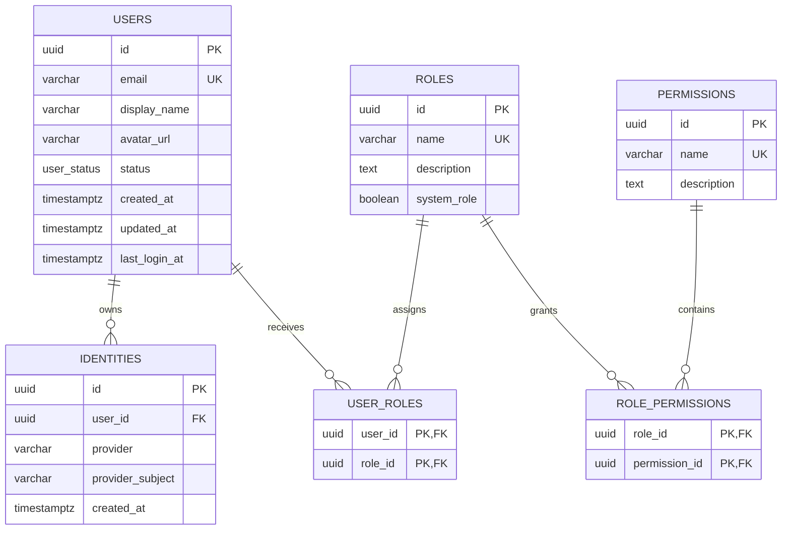

# Authentication and authorization ERD

A user may own zero or more external identities and may receive zero or more
roles. A role may belong to many users and grants zero or more permissions.
Both association tables use composite primary keys, so duplicate assignments are
not possible.
